# genetic_coverage_planning
Genetic optimization for multi agent coverage path planning

to use code:
from inside ipython3 console:

`run src/pather_driver.py` will initialize dataset and run first 100 evolutions

When run, it will first show the current map to verify that it has been segmented correctly. Press `Esc` to continue. Then it will show the waypoint layout and the selected starting position. Close the window to continue. Next, It generates the initial population and shows their fitness values in the simple GUI. Left clicking on an organism will show the final paths and statistics about the paths. Right click will animate the agents flying their paths for more clarity. Close this window to continue the evolution.

to visualize current population:
`got.plotty(population,pather,mappy)`

An example of what the visualization looks like:
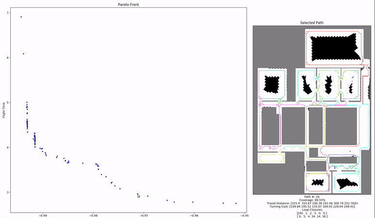

to continue evolving:
`population.RunEvolution(10)` will evolve 10 more generations

to check where a waypoint index is on the map (useful for changing starting location):
`mappy.visualizeWaypoints(pather._XY, 207)` , change out 207 with desired waypoint idx. NOTE: since this is opencv, to avoid crashing, press any key to close window while window is selected. otherwise you could cause a hangup

to visualize pareto front over time:
`got.plotParetoHist(pareto_hist)` NOTE: to continue updating the pareto history after first 100 evolutions use `pareto_hist += population.RunEvolution(10)` rather than `population.RunEvolution(10)`.

to visualize average objective values over time:
`got.plotFitness(pareto_hist)`

Most changes to update map or tune parameters can be done in `pather_driver.py`. Which is well documented to explain what each line does.

I use pickle to save off populations to use them again later. An example of how to save and load populations using pickle.
To save:`got.savePopulation(population, "six_agent_pop.pickle")`
To load:`population = got.loadPopulation("pickle_files/six_agent_pop.pickle")`

After a path is selected and satisfactory. It can be saved to an npz file to be loaded into a c++ waypoint manager. Use savePath(organism, height, offset_window, offset_threshold, file_name, prune=False). Here is an example of this call: `got.savePath(population._gen_parent[0], -1.5, 20,5, "waypoints.npz", prune=False)` To load these waypoints in, use the [relative waypoint manager package](https://magiccvs.byu.edu/gitlab/jacobmo/relative_waypoint_manager) or [qt_planner package](https://magiccvs.byu.edu/gitlab/jacobmo/qt_planner). Neither of these have full support for it, but it was being built.

For everything else, I did my best to document the code so good luck?
___
## Source Code Listing
`geneticalgorithm.py` -- Contains classes for genetic algorithm and organism gets instantiated in pather_driver

`gori_tools.py` -- contains functions that are not members of classes such as plotting and wrapping

`mappy.py` -- contains map class. if you want to generate a new map. this is where you do it. class is instantiated in pather_driver

`pather_driver.py` -- Driver file instantiates classes and starts evolution.

`pathmaker.py` -- holds physical waypoint locations and traversabilty graph, instantiated in pather_driver

`pointselector.py` -- class that enables interaction with population visualization plot
___
## Writeup
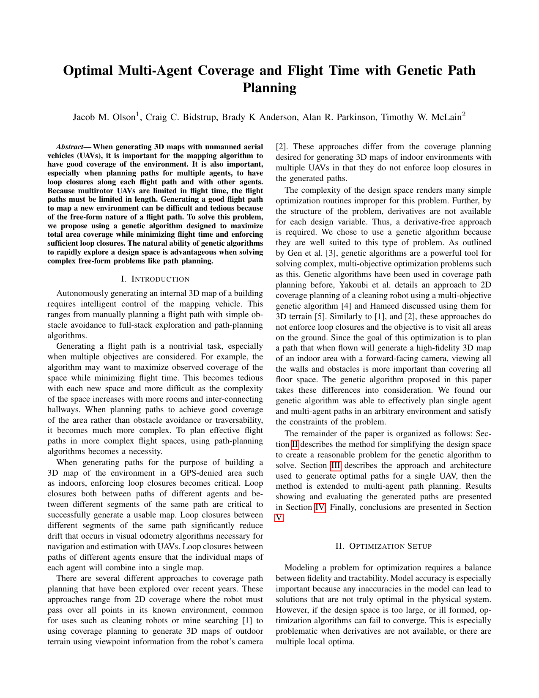
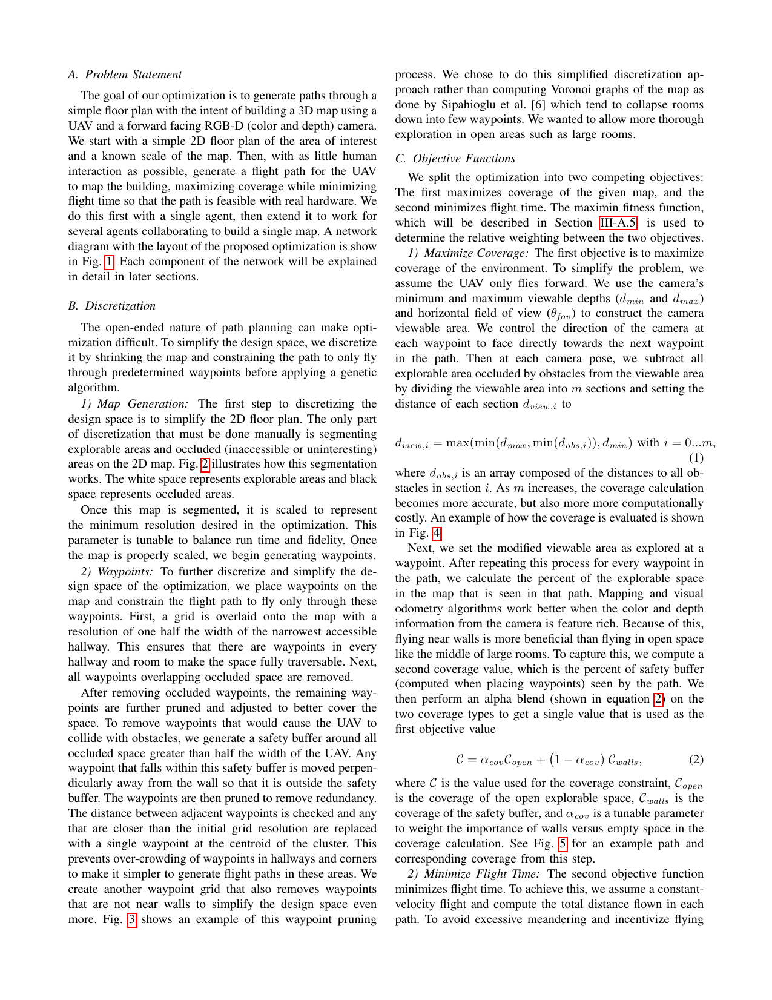
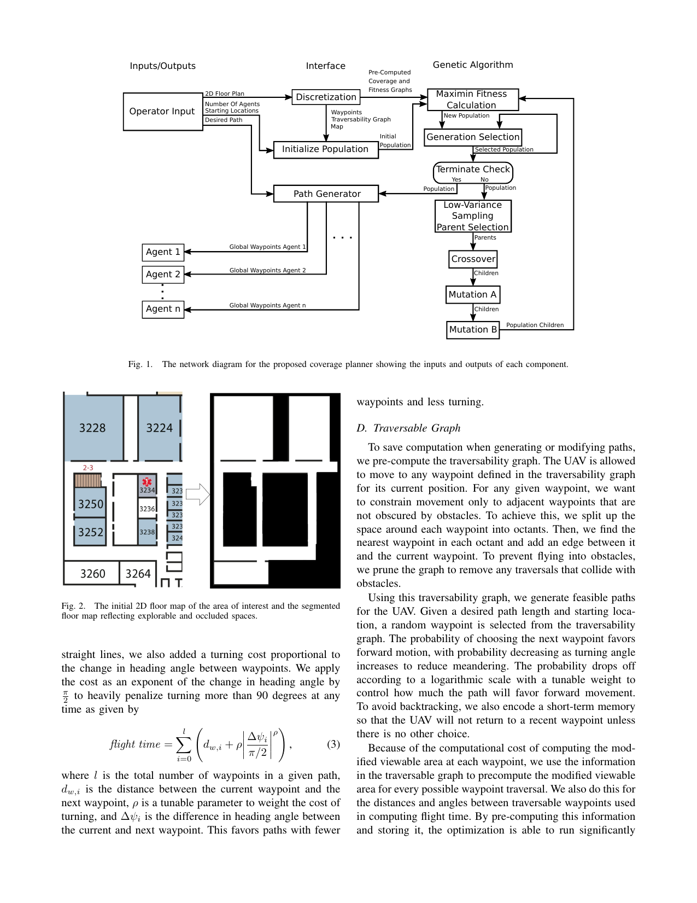
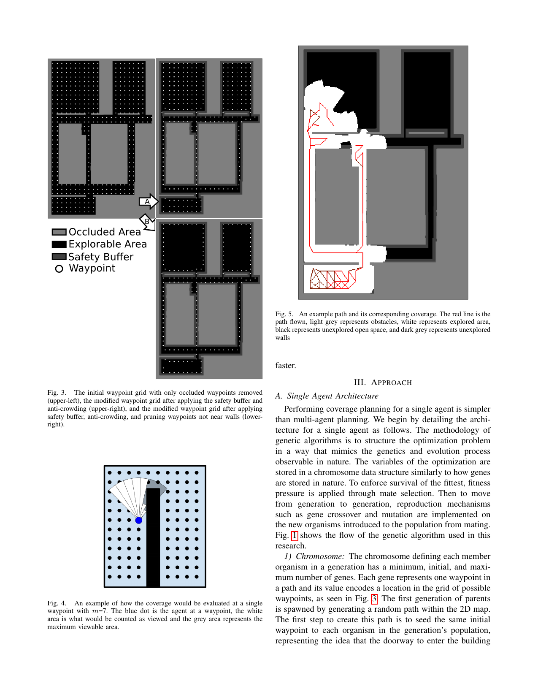
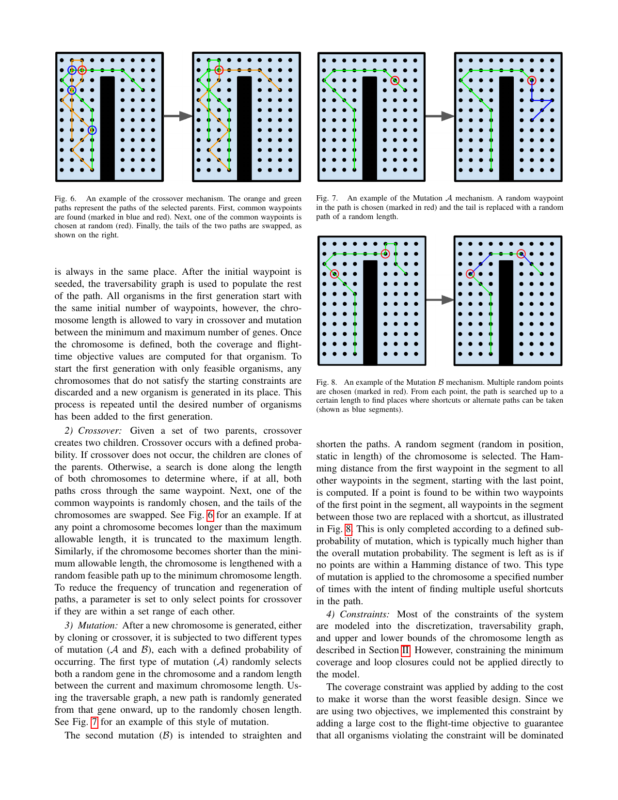
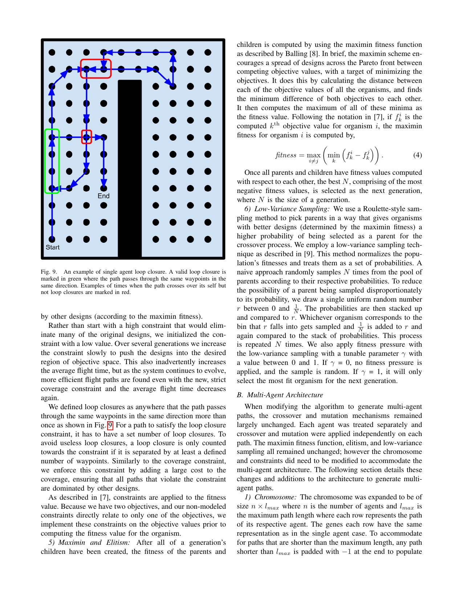
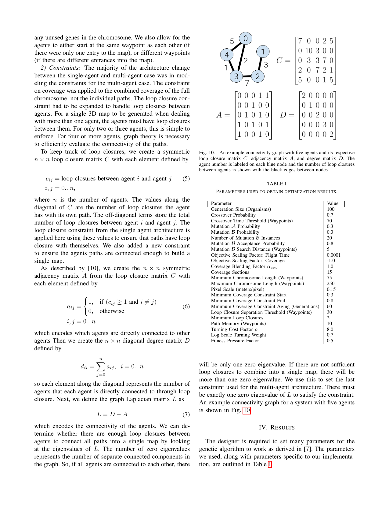
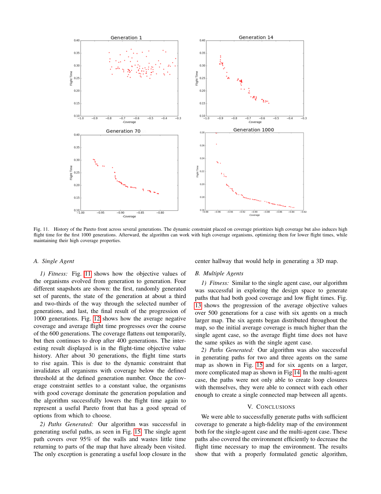
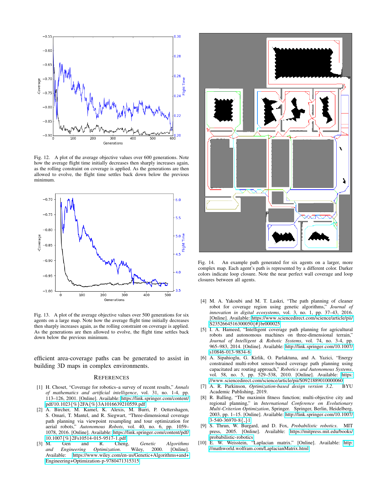
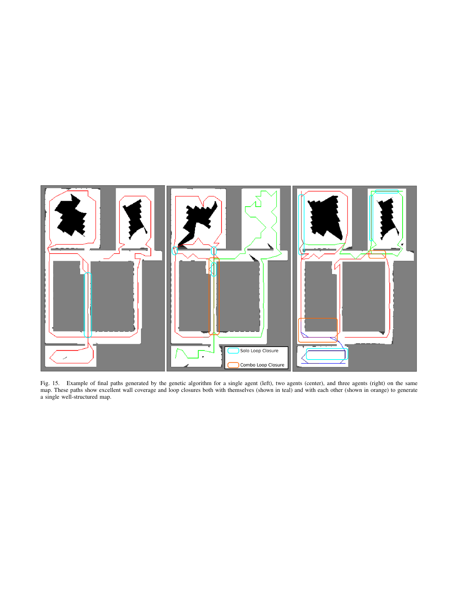
