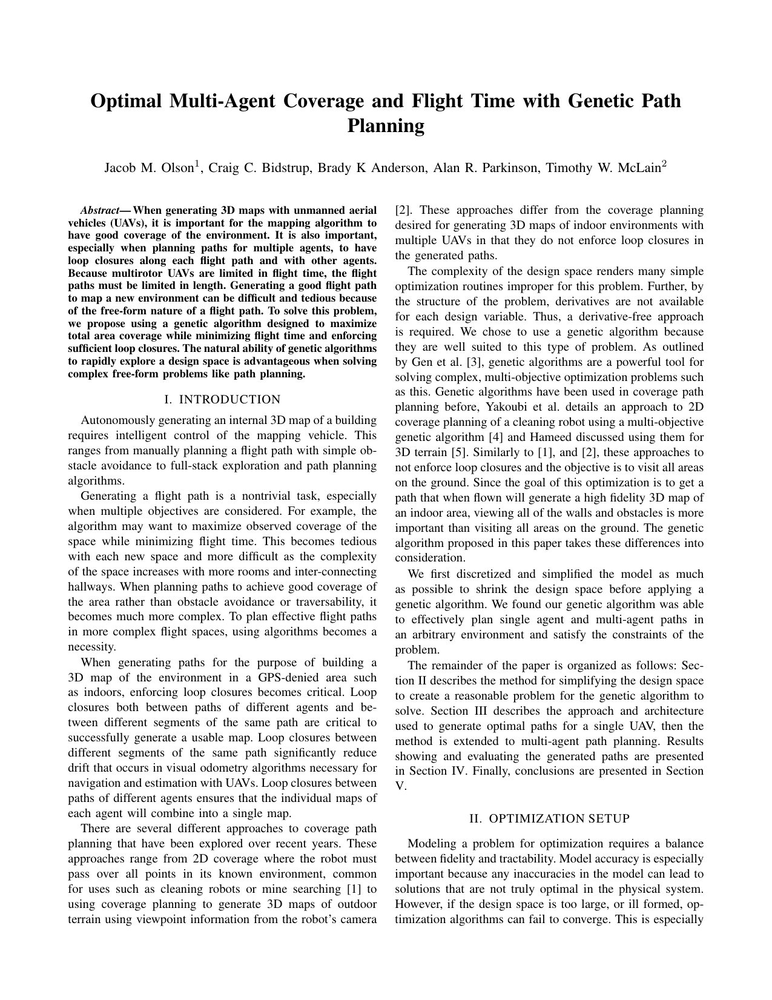
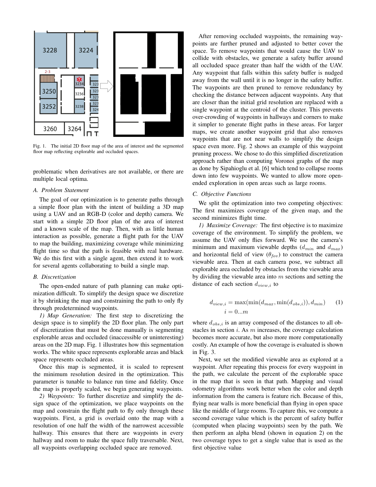
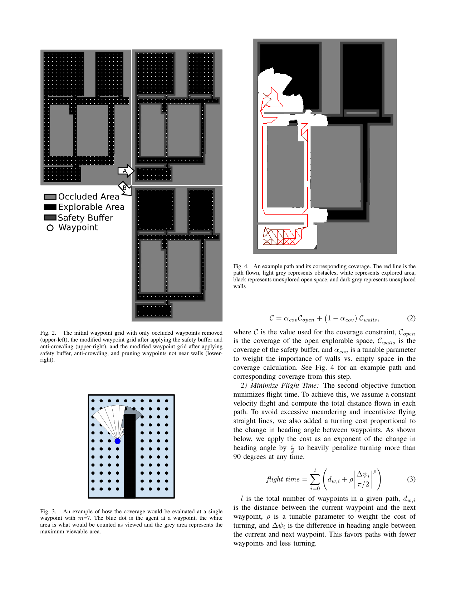
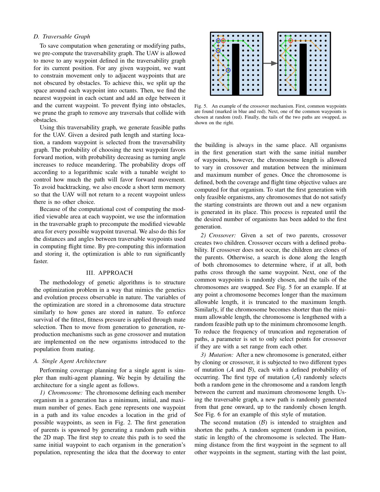
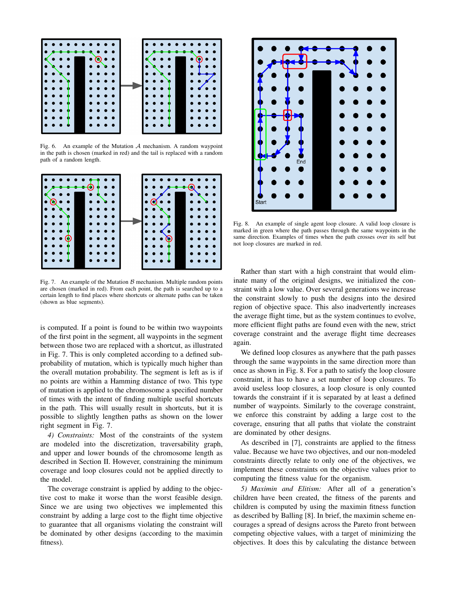
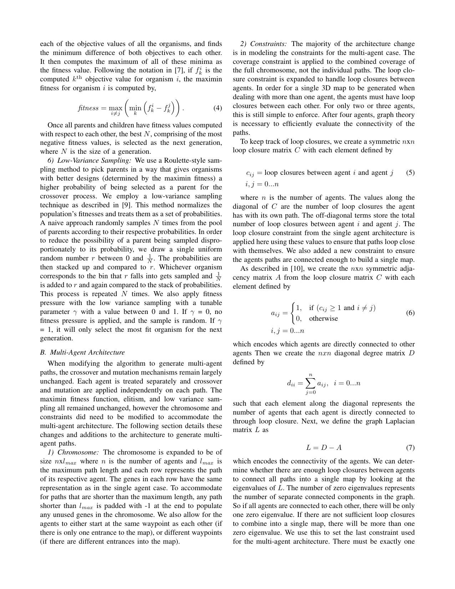
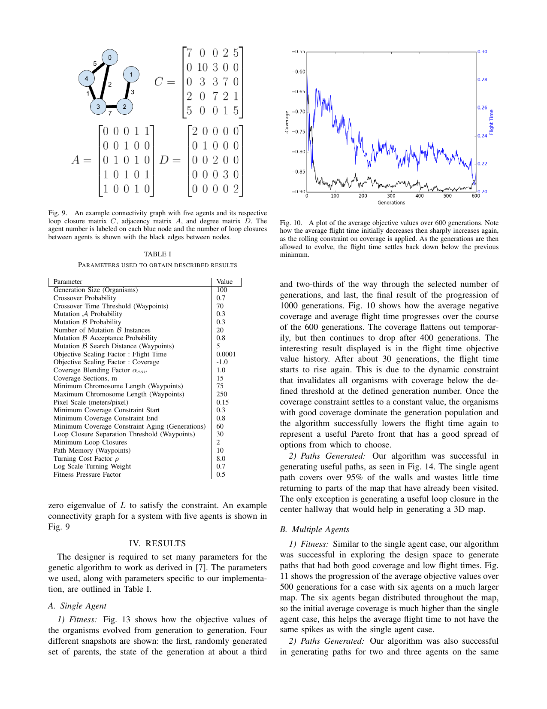
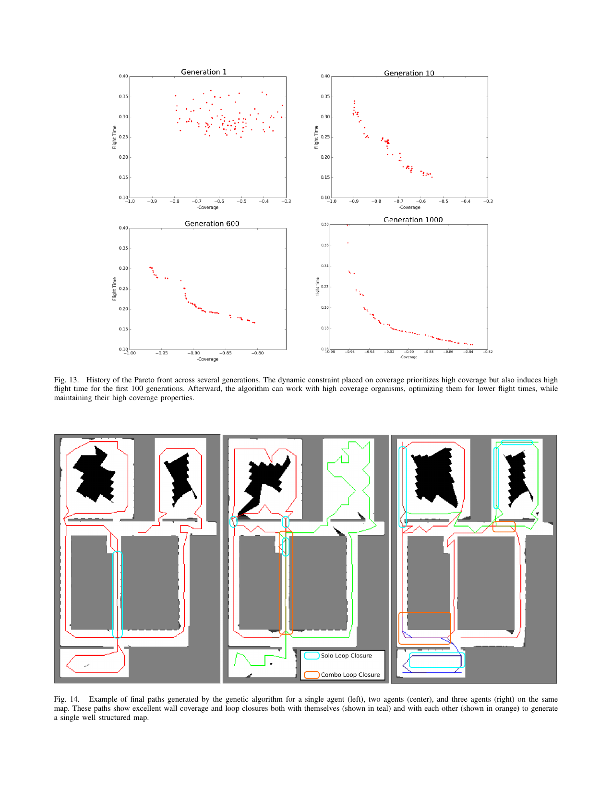

# genetic_coverage_planning
Genetic optimization for multi agent coverage path planning

to use code:
from inside ipython3 console:

`run src/pather_driver.py` will initialize dataset and run first 100 evolutions

to visualize current population:
`got.plotty(population,pather,mappy)`

to continue evolving:
`population.RunEvolution(10)` will evolve 10 more generations

to check where a waypoint index is on the map (useful for changing starting location):
`mappy.visualizeWaypoints(pather._XY, 207)` , change out 207 with desired waypoint idx. NOTE: since this is opencv, to avoid crashing, press any key to close window while window is selected. otherwise you could cause a hangup

to visualize pareto front over time:
`got.plotParetoHist(pareto_hist)` NOTE: to continue updating the pareto histor after first 100 evolutions use `pareto_hist += population.RunEvolution(10)` rather than `population.RunEvolution(10)`.

to visualize average objective values over time:
`got.plotFitness(pareto_hist)`

___
## Source Code Listing
`geneticalgorithm.py` -- Contains classes for genetic algorithm and organism gets instantiated in pather_driver

`gori_tools.py` -- contains functions that are not members of classes such as plotting and wrapping

`mappy.py` -- contains map class. if you want to generate a new map. this is where you do it. class is instantiated in pather_driver

`pather_driver.py` -- Driver file instantiates classes and starts evolution.

`pathmaker.py` -- holds physical waypoint locations and traversabilty graph, instantiated in pather_driver

`pointselector.py` -- class that enables interaction with population visualization plot
___
## Writeup

